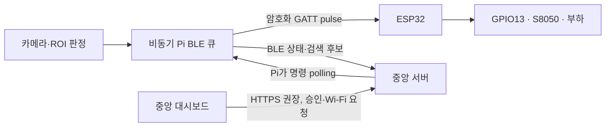

# Pi–ESP32 BLE 출력 연동

## 구성과 책임

- Pi가 카메라 추론과 ROI 판정을 합니다. ESP32는 GPIO13과 S8050으로 저전압 DC 부하를 스위칭합니다. 물리 릴레이는 없습니다.
- Pi와 ESP32의 트리거·Wi-Fi 설정 통신은 BLE입니다. ESP32의 Wi-Fi가 Pi 또는 대시보드와 다른 망이어도 트리거는 계속됩니다.
- Pi는 ESP32를 BLE로 검색하고, 중앙 대시보드에서 승인된 고유 기기 ID와만 연결합니다.
- Pi는 등록된 중앙 서버로 15초마다 BLE 상태와 검색 후보를 하트비트로 보냅니다. 대시보드는 Pi 주소로 직접 접속하지 않습니다.

## ROI 출력 동작

- 감지 대상이 비제외 `trigger` ROI 안에 연속해서 `rois.json`의 `debounce` 시간 동안 있으면 펄스를 한 번 보냅니다. 설정이 없으면 기존 기본값인 0.5초를 씁니다.
- 대상이 모두 ROI를 벗어나면 해당 ROI의 상태를 초기화하고, 다음 진입에서 다시 작동합니다. ROI 간 펄스 상태는 오디오 안내의 cooldown과 독립입니다.
- 펄스 기본 길이는 500ms입니다. ESP32가 비동기 타이머로 출력을 끄므로 Pi나 BLE 연결이 끊겨도 출력이 계속 켜지지 않습니다.
- 프레임 루프는 BLE나 서버 응답을 기다리지 않고 제한된 큐에 이벤트 ID를 넣습니다. 같은 ID로 재시도하고, 이미 처리된 이벤트는 ESP32가 중복 작동시키지 않습니다.

## BLE 서비스

서비스 UUID `8a7c0001-3f72-4a1d-9c10-56495347554e`에 세 특성을 둡니다.

| 특성 | UUID 끝 | 접근 | 목적 |
|---|---|---|---|
| Info | `0002` | 읽기 | 고유 ID, Wi-Fi 연결 상태·SSID·IP, GPIO 명령 상태 |
| Command | `0003` | 암호화 쓰기 | `pulse`, `configure_wifi` 명령 |
| Result | `0004` | 암호화 읽기·알림 | `request_id`에 대응하는 처리 결과 |

명령 JSON은 기본 ATT MTU에서도 전송되도록 18바이트 조각으로 나눕니다. 각 조각은 `[index, count, payload…]` 형식이며 ESP32는 순서가 맞는 조각만 이어 붙입니다. ESP32 Arduino Core의 BLE 보안 API로 bonding과 LE Secure Connections를 사용합니다. ESP32 ID는 eFuse MAC에서 생성하므로 Wi-Fi 주소가 바뀌어도 유지됩니다.

## 대시보드와 서버 API

- 운영자는 기기 상세 → **네트워크** 탭의 발견 목록에서 ESP32 ID를 한 번 승인합니다. 서버는 승인 ID를 기기 레코드에 보관합니다.
- `GET /api/devices/{device_id}/esp32`는 Pi가 보고한 상태·후보 목록과 명령 상태를 반환합니다.
- `POST /api/devices/{device_id}/esp32/binding`은 최근 발견된 후보를 승인합니다. ESP32 하나는 한 Pi에만 연결할 수 있고, 연결 변경·`DELETE` 해제 시 기존 Wi-Fi 명령을 취소합니다.
- `POST /api/devices/{device_id}/esp32/wifi`는 새 SSID와 비밀번호를 10분 만료의 메모리 명령으로 큐에 넣습니다. 이미 처리 중인 명령이 있으면 `409`를 반환합니다.
- Pi는 `GET /api/devices/me/esp32/control`로 승인 ID와 명령을 가져오고, BLE 적용 뒤 `POST /api/devices/me/esp32/commands/{command_id}/result`로 결과를 보냅니다. 이 경로는 Pi가 먼저 연결하므로 NAT 뒤에서도 사용할 수 있습니다.
- 서버는 Wi-Fi 비밀번호를 상태 응답이나 로그에 넣지 않으며, Pi가 결과를 확인하면 대기 명령을 삭제합니다. 명령은 중앙 서버 프로세스 재시작 시 사라지므로 대시보드에서 다시 요청해야 합니다.

Wi-Fi 비밀번호는 브라우저에서 중앙 서버로, 서버에서 Pi로 전달됩니다. 이 프로젝트의 기존 `PUBLIC_BASE_URL` 설정은 HTTP일 수도 있으므로, 운영망 밖에서 사용하거나 신뢰되지 않는 네트워크를 통과한다면 중앙 대시보드와 Pi의 서버 주소를 HTTPS로 제공해야 합니다. BLE 구간은 암호화됩니다.

## Wi-Fi 변경 및 복구

ESP32는 대시보드에서 받은 새 자격증명으로 접속을 시도하는 동안 BLE 서비스를 유지합니다. 새 망 접속에 성공한 경우에만 SSID·비밀번호를 ESP32 NVS에 저장합니다. 실패하면 이전 설정으로 복귀하고, BLE로 성공·실패 결과를 Pi에 알립니다. Wi-Fi가 끊겨도 GPIO13 트리거와 상태 조회는 BLE로 계속됩니다.

## 배포와 확인

- Pi 모듈 `device/esp32_relay.py`는 `Makefile`의 `DEPLOY_PY`에 포함하며 `bleak`을 설치합니다. 기존 Pi GATT 프로비저닝 서비스와 같은 BlueZ 어댑터를 사용합니다.
- Arduino IDE에는 ESP32 Arduino Core와 ArduinoJson 7.x가 필요합니다. BLE 지원은 ESP32 Arduino Core에 포함됩니다. 기본 앱 파티션은 펌웨어보다 작으므로 `Huge APP (3MB No OTA/1MB SPIFFS)`를 선택하고, `tools/dev/esp32_relay/README.md`의 배선과 업로드 절차를 따릅니다.
- 실기기에서 확인할 순서: ESP32 부팅 후 Wi-Fi 없이 BLE 발견 → 대시보드 승인 → 다른 공유기 자격증명 적용 → Pi와 ESP32 Wi-Fi가 달라도 ROI 진입 펄스 작동 → 잘못된 비밀번호 입력 시 이전 Wi-Fi로 복귀 → 대시보드 상태 갱신.
- ROI 제외구역, 대상이 없는 ROI, 비밀번호가 틀린 요청, ESP32 전원 차단, Pi 재시작도 확인합니다. 어느 오류도 카메라 추론을 막아서는 안 됩니다.
